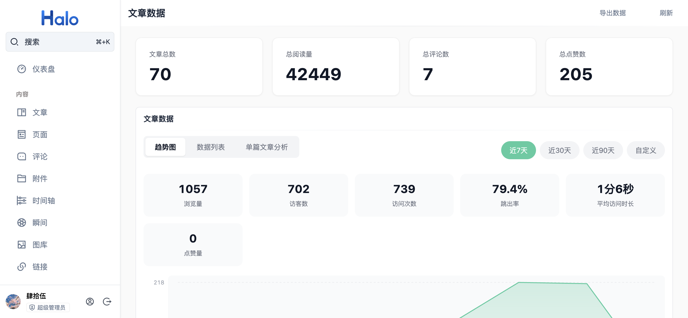
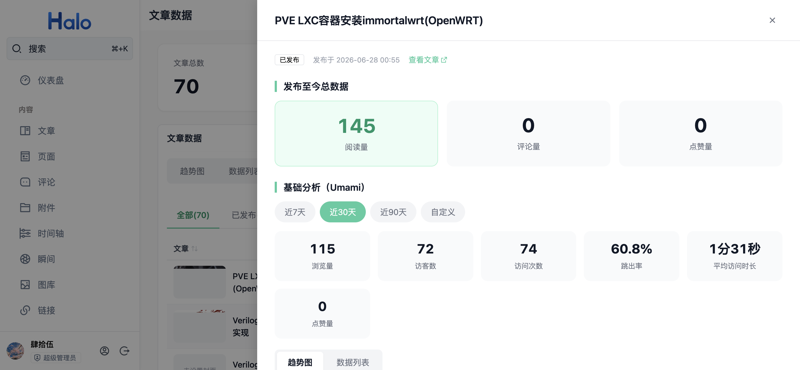

# plugin-article-analysis

Halo 文章数据趋势分析插件：在 Console 提供全站与单篇文章的数据看板，帮助站长掌握内容表现。

💬 **使用交流**：插件配套的 Umami 部署与数据统计教程见博客文章 [《Halo 博客访问量统计系统：Umami 自托管部署完整教程》](https://blog.songshiyu.cn/archives/halobo-ke-fang-wen-liang-tong-ji-xi-tong-umami-zi-tuo-guan-bu-shu-wan-zheng-jiao-cheng)，遇到问题或有功能建议欢迎在文章下方留言评论，会及时回复。

## 功能特性

### 全站数据看板

- 汇总卡片：文章总数、总阅读量、总评论数、总点赞数
- 区间统计：浏览量、访客数、访问次数、跳出率、平均访问时长、点赞量
- 趋势图：每日浏览量折线图，支持悬停查看当日浏览量 / 访问次数 / 点赞量
- 数据列表：按天的浏览量 / 访问次数 / 点赞量明细
- 时间范围：近 7 天 / 近 30 天 / 近 90 天 / 自定义起止日期



### 单篇文章分析

- 文章列表：封面、标题、状态、分类、阅读、评论、点赞、发布时间
- 支持关键词搜索、分类筛选、状态页签（全部 / 已发布 / 草稿 / 待审核）、列头排序与分页
- 单篇详情抽屉：发布至今总数据（阅读 / 评论 / 点赞）+ 区间趋势图与每日明细
- 一键导出当前筛选结果为 CSV（带 BOM，Excel 可直接打开）



### 每日点赞统计

Halo 仅保存文章的累计点赞数，不记录每次点赞的时间。本插件通过周期性比对文章点赞计数快照，将增量归属到当日并持久化，从而提供按日维度的点赞统计：

- 全站视图展示全站文章当日点赞合计，单篇抽屉展示该文章的每日点赞
- 数据自插件启用后开始积累，启用前的历史点赞无法按日追溯；插件重启不丢数据
- 与前台展示口径一致，统计原始点赞计数（不扣减取消点赞）
- 统计时区默认为服务器时区，可在插件设置中修改（如 `Asia/Shanghai`）

## 安装

要求 Halo 2.21+（建议在 2.23 及以上版本使用）。

1. 从 [Releases](https://github.com/shirainbown/plugin-article-analysis/releases) 下载最新的 `plugin-article-analysis-*.jar`
2. Halo Console → 左侧「插件」→ 右上角「安装」→ 上传 jar 并启用
3. 左侧「内容」下出现「文章数据」菜单即安装成功

升级：Console → 插件 → 「文章数据趋势分析」→「升级」，上传新版本 jar 即可，配置不会丢失。

## 配置

入口：Console → 插件 → 「文章数据趋势分析」→ 设置。

### Umami 统计（可选）

趋势图中的浏览量、访客数、访问次数、跳出率、平均访问时长来自 [Umami](https://umami.is/)，需自行部署 Umami 并在插件设置中填写：

| 字段 | 说明 |
| --- | --- |
| Umami 服务地址 | 如 `https://umami.example.com`（不含末尾斜杠） |
| 站点 ID（Website ID） | Umami 网站详情中的 Website ID（UUID） |
| 登录用户名 / 密码 | Umami 后台的登录账密，插件后端用它登录换取访问令牌后查询数据 |

登录账密仅保存在服务端 ConfigMap 中，由插件后端代理查询，不会下发到浏览器。未配置 Umami 时，文章列表、汇总卡片、每日点赞统计与导出功能均正常，仅趋势图区域提示未配置。

### 点赞统计

| 字段 | 说明 |
| --- | --- |
| 统计时区 | 每日点赞按此时区的自然日归档，例如 `Asia/Shanghai`；留空使用服务器默认时区 |
| 数据保留天数 | 按日明细只保留最近 N 天（默认 90，可选 7–365），过期数据在每次轮询时自动清理 |
| 轮询间隔 | 点赞计数快照的采集间隔（默认 300 秒，可选 60–3600），修改后需重启插件生效 |

## 数据存储与生命周期

插件仅产生一类自有数据：每日点赞统计，全部存放在 Halo 扩展存储的单个 ConfigMap `article-analysis-upvote-daily` 中（不引入外部数据库），采用有边界的存储设计：

- **采集**：后台线程按固定间隔（默认 300 秒）读取文章 Counter 快照并计算增量，增量记入当日；文章删除后其快照在下一次轮询自动移除
- **保留**：按日数据只保留最近「数据保留天数」（默认 90 天），过期 key 在每次轮询时自动裁剪；每天最多记录 1000 篇文章的明细，超出部分只累计到全站总数，存储体积不会随文章数与时间无限增长
- **查询**：`GET /apis/api.article-analysis.io.github.shirainbown/v1alpha1/upvotes/daily?days=N` 只返回最近 N 天（默认 90，最大 365）
- **清理**：`DELETE /apis/api.article-analysis.io.github.shirainbown/v1alpha1/upvotes/daily` 可清空全部统计数据（Console 管理员身份调用），下一轮轮询自动重建快照
- **备份**：统计数据仅存在于上述 ConfigMap，随 Halo 站点备份（Console → 系统 → 备份）一并导出，无需单独备份方案
- **卸载**：卸载插件后统计数据不再被读写，可手动删除 ConfigMap 完成清理：Console → 系统 → 设置 → 高级（或直接调用 `DELETE /api/v1alpha1/configmaps/article-analysis-upvote-daily`）；插件卸载不会主动删除数据，重装后历史统计仍可继续使用
- **Umami 数据**：浏览量等趋势数据存储在你自建的 Umami 服务中，插件只代理查询、不落地保存，其生命周期由 Umami 自身管理

## 使用

入口：Console → 内容 → 文章数据。

- **趋势图**：全站每日趋势，鼠标悬停查看单日数据
- **数据列表**：全站每日明细（倒序）
- **单篇文章分析**：文章管理表格，行内「数据」打开单篇详情抽屉，「编辑」跳转编辑器，「查看」跳转前台页面
- **导出数据**：右上角导出当前筛选结果为 CSV

## 构建

```bash
# 前端（产物写入 src/main/resources/console）
pnpm -C ui install && pnpm -C ui build

# 插件 jar（产物 build/libs/plugin-article-analysis-<version>.jar，需 JDK 21）
./gradlew build -x test
```

## License

[MIT](./LICENSE)
